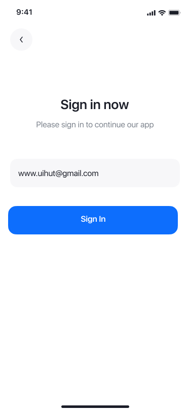
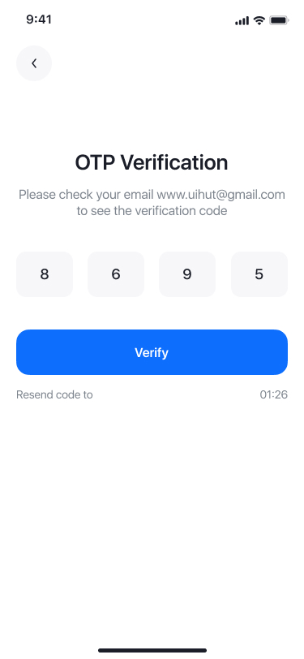
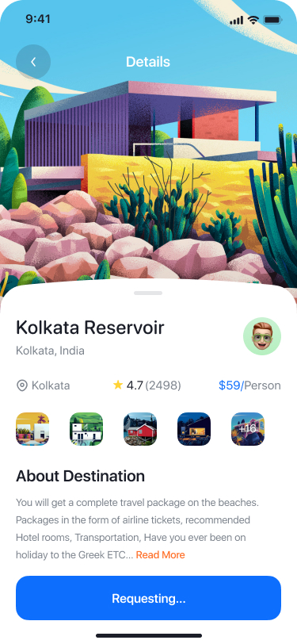

# Customer App – Booking Agent

Customer App for the travel destination booking.
The app allows users to log in using email OTP, browse available destinations, and send booking requests.

---

## Features

- **Email OTP Login**
  - Users authenticate using email-based OTP.
    

  
  

- **Browse Destinations**
  - Horizontally scrollable destination cards.
  
- **Destination Details**
  - View detailed information about a selected destination.
  
- **Book Now**
  - Users can send a booking request for a destination.
  
- **Real-time Status Updates**
  - Booking status (`Requesting / Accepted / Rejected`) updates instantly without full screen refresh.
  

---

## Real-time Sync

- Firebase Firestore is used for real-time synchronization.
- Booking status updates from the Owner App are reflected instantly in the Customer App.

---

## Tech Stack

- **Language:** Kotlin
- **UI:** Jetpack Compose
- **Architecture:** MVVM
- **State Management:** StateFlow
- **Backend:** Firebase Firestore
- **Authentication:** Email OTP (Descope Email OTP Auth)
- **Async:** Kotlin Coroutines & Flow

---
## Owner App

- **Owner App Repository:**  
  https://github.com/001iftikar/Owner-Intern.git

